# EXAMINATION PROJECT

# DEPLOYMENT OF LAMP STACK

# objective

-Automate the provisioning of two Ubuntu-based servers, named “Master” and “Slave”, using Vagrant.

-On the Master node, create a bash script to automate the deployment of a LAMP (Linux, Apache, MySQL, PHP) stack.

-This script should clone a PHP application from GitHub, install all necessary packages, and configure Apache web server and MySQL. 

**Using an Ansible playbook:**

- Execute the bash script on the Slave node and verify that the PHP application is accessible through the VM’s IP address (take screenshot of this as evidence)

- Create a cron job to check the server’s uptime every 12 am.

**PHP Laravel GitHub Repository:**

https://github.com/laravel/laravel

I achieved these tasks solely using vagrant.

# PROJECT STEPS :-

**INTRODUCTION**

- It is important first of all to configure your Master Ubuntu-based Servers. Install your virtual machine and run the command, ```vagrant init ubuntu/focal64```. But before you do a ```vagrant up```, open the configuration file, ```nano Vagrantfile``` and make sure to configure the uncommented parts of this vagrantfile as seen below;

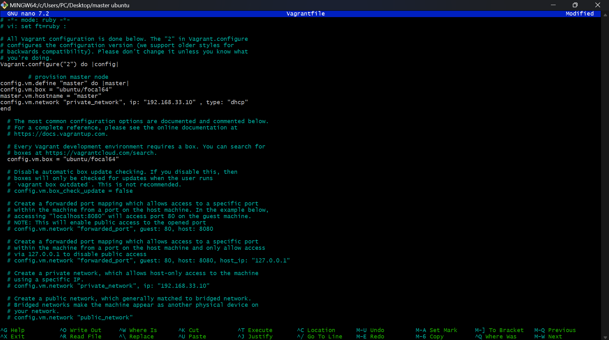

- Then configure your Slave Ubuntu Server in the same as you did for the Master.

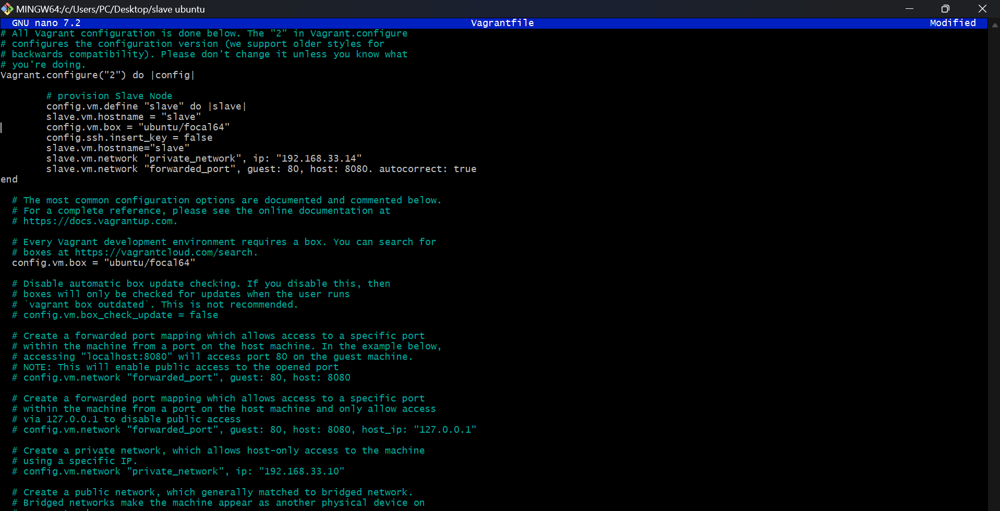

1. The first step is to run a ```sudo apt update``` and ```sudo apt upgrade -y``` to ensure your system files are properly updated and upgraded for the task ahead.

2.  Run a LAMP stack, which stands for (LINUX, APACHE, MYSQL, PHP); by first of all installing your apache2 via the command ```sudo apt install apache2 -y```.

3.  Install the MySQL database server.  ```sudo apt install mysql-server -y```. Important also to run the MySQL secure installation script to improve the security of your MySQL installation. This will prompt you to set a root password, remove anonymous users, disallow root login remotely, and remove the test database. This is the command; ```sudo mysql_secure_installation```

4. Here is how to install PHP. 
- First, Add Ondřej's PHP Repository: Ondřej Surý maintains a repository with updated PHP versions. Add it to your system to access PHP 8.2.  This is the command; ```sudo add-apt-repository ppa:ondrej/php```

- Second, Update the package lists of your linux machine since you just added a php repository by running the command; ```sudo apt update```

- Then, Install PHP 8.2 along with commonly used extensions; ```sudo apt install php8.2 php8.2-cli php8.2-common php8.2-mysql php8.2-xml php8.2-mbstring php8.2-curl -y```. 

- Afterwards you can run ```php -v``` to see the latest version of PHP installed. After you are done, If you're using PHP with Apache, you may need to restart the Apache web server to apply the changes. Run; ```sudo systemctl restart apache2```.

5. Let us then create a user on in MYSQL. Switch to your MySQL database by running the command ```sudo mysql```. 

6. Create a Database. Then grants all privileges on the specified database to the user you already created. Afterwards,  you need to flush the privileges to apply the changes.

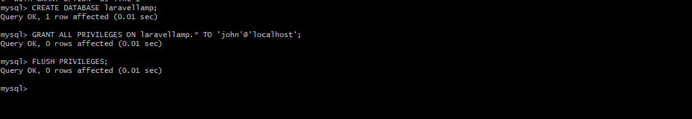

*When you are done on your MySQL database, always exit it with the command ```exit```*

7. The next step is to download your composer file that enables PHP 8.2 to work efficiently. Here is the command to run; ```curl -sS https://getcomposer.org/installer | php -- --2```. Move the file to an executable path while renaming the file 'composer' at the same time. This is the command; ```sudo mv composer.phar /usr/local/bin/composer```

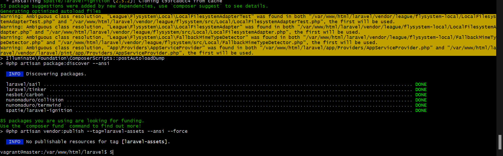

8. Switch to your Apache default document root directory (where your web files are served from): that is ```/var/www/html/```. Assign everything in the 'html' directory to vagrant, which is the user, (you can replace the 'vagrant' with whatever user you have in your own machine) as its owner by running the command; ```sudo chown -R vagrant:vagrant .``` This ensures that the folder 'html' where you will cloning your laravel repo is writable by that user. Then Clone the Laravel Github repository there. 

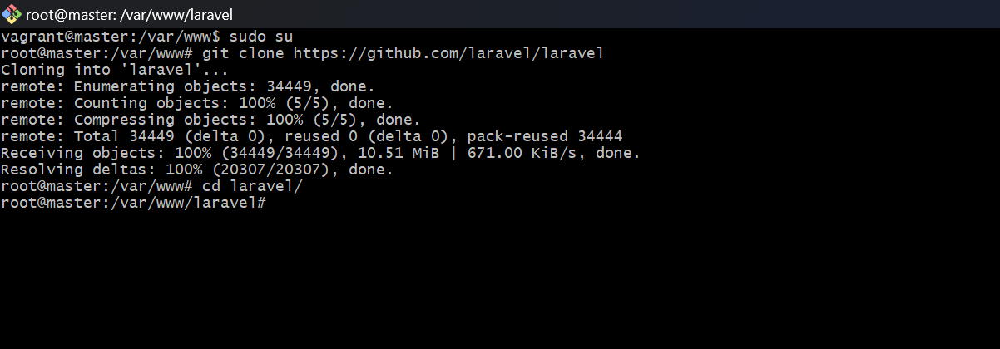

9. Then go into your laravel repo you just cloned, that is ```cd /var/www/html/laravel``` and run the ```composer install``` command. Remember the composer you are installing now is the ```composer.phar``` file you renamed to 'composer' and moved into the executable path in your previous Step 7. You should get this interface at the end of your installation.


*When you run the ```ls``` command in your laravel repo, you will discover two new added files to your repo that were not there before. The 'composer.lock' and 'vendor' files.*

10. Make sure you are still on the path, ```/var/www/html/laravel```. Copy your .env.example file to .env by running the command; ```cp .env.example .env``` Copy this this file enables Apache to read and render it as it doesn't understand the .env.example file.

11. When you run the application, it creates a log file which goes into the directory called storage. cd into the storage in your laravel repo. Then cd into the logs stored in the storage directory. Apache has a user called www-data. And this user is what tries to write into the logs file. So now, make the owner of the storage folder, to be the www-data user. 

12. cd back to your laravel path, that is /var/www/html/laravel and run the command; ```sudo chown -R www-data:www-data storage/```

13. Next is to generate your application encryption key. Run the command; ```php artisan key:generate```. You should be greeted with an interface as this;


14. Afterwards, open your .env file with any text editor, vim, vi or nano and edit the following marked areas.


```

DB_CONNECTION=mysql
 DB_HOST=localhost
 DB_PORT=3306
 DB_DATABASE=laravel
 DB_USERNAME=appuser
 DB_PASSWORD=vagrant

```
*The DB_CONNECTION should match the database you are using which is mysql. DB_DATABASE, which is the database you created on your mysql. DB_USERNAME, is the user you created on your mysql. DB_PASSWORD is the password you have already set for it in your database* 

15. Next step is to run the command; ```php artisan migrate```. When you do this, you should be greeted with an interface as this;

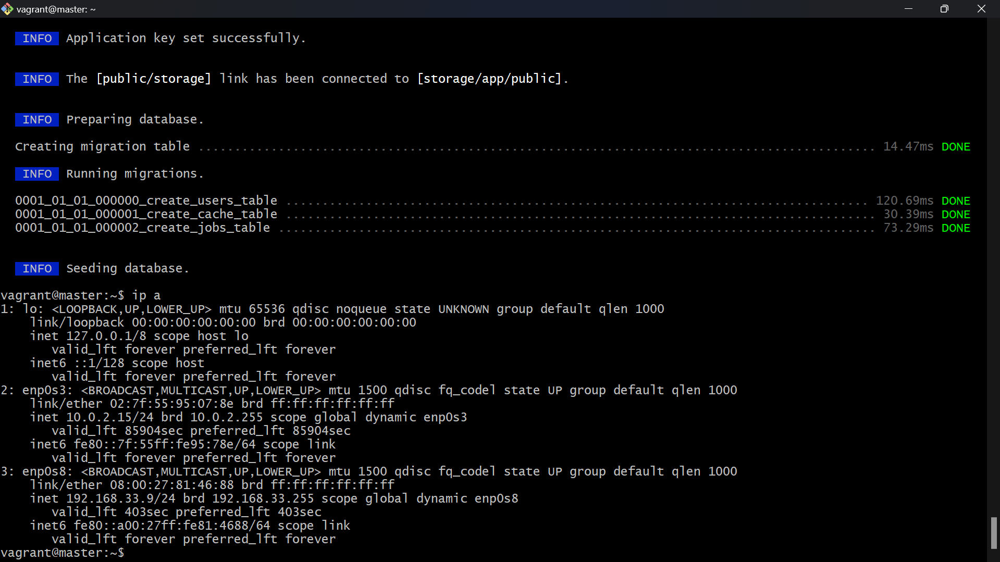

16. In other to enable the laravel site, you need to overrite the default apache rules. To do this; run the command ```cd /etc/apache2/sites-available```. Run the list command and edit the configurations contained in the '000-default.conf' file  running; ```sudo vim 000-default-conf```. In this file; add to the Document root path, '/laravel/public'.

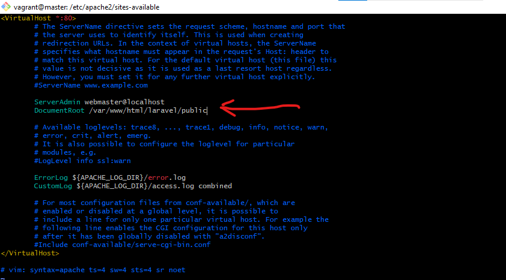

17. After doing these, restart your apache by running the command; ```sudo systemctl restart apache2```.

18. Go back to your web browser, input the ip address of your master node and you  should be greeted with the laravel homepage interface below;

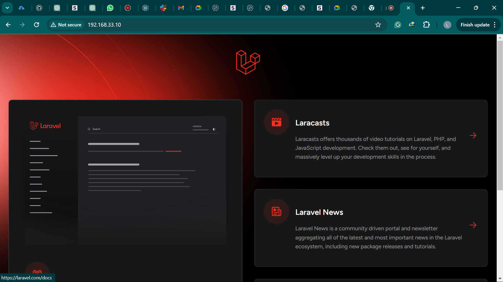

*Create a BashScript file that will automate these whole process and deploy them on the slave server. This is a sample of how your bashscript should look like;*

```
#!/bin/bash

#update your linux system
sudo apt update -y

#install your apache webserver
sudo apt install apache2 -y
#add the php ondrej repository
sudo add-apt-repository ppa:ondrej/php --yes
#update your repository again
sudo apt update -y
# install php8.2
sudo apt install php8.2 -y
#install some of those php dependencies that are needed for laravel to work
sudo apt install php8.2-curl php8.2-dom php8.2-mbstring php8.2-xml php8.2-mysql zip unzip -y
#enable rewrite
sudo a2enmod rewrite
#restart your apache server
sudo systemctl restart apache2

sudo apt install mysql-server -y
# sudo apt install mysql-client -y
sudo systemctl start mysql

sudo mysql -uroot -e "CREATE DATABASE laravel;"
sudo mysql -uroot -e "CREATE USER 'appuser'@'localhost' IDENTIFIED BY 'vagrant';"
sudo mysql -uroot -e "GRANT ALL PRIVILEGES ON laravel.* TO 'appuser'@'localhost';"


#change directory in the bin directory
cd /usr/bin
install composer globally -y
sudo curl -sS https://getcomposer.org/installer | sudo php -q
#move the content of the deafault composer.phar
sudo mv composer.phar composer
#change directory in /var/www directory so we can clone of laravel repo there
cd /var/www/
sudo git clone https://github.com/laravel/laravel.git
sudo chown -R $USER:$USER /var/www/laravel
cd laravel/
install composer autoloader
composer install --optimize-autoloader --no-dev --no-interaction
yes |sudo composer update --no-interaction
#copy the content of the default env file to .env
sudo cp .env.example .env
sudo sed -i "23 s/^#//g" /var/www/laravel/.env
sudo sed -i "24 s/^#//g" /var/www/laravel/.env

```
19. Connect to your slave Ubuntu machine through your master. To achieve this; make sure to generate ssh keys on your master node and copy the public keys to the list of authorized keys in your slave node. The command to connect to slave through the master is ```ssh vagrant@<ipaddress>```. Replace the ipaddress with that of your slave node. 

20. Create an inventory file and playbook on your Master Server. Add the list of your servers, in this case only the slave server to the list of your inventory file. Then run the command; ```ansible all -m ping -i host``` to ensure your master server connected to your slave server. You shoud get an interface as this;

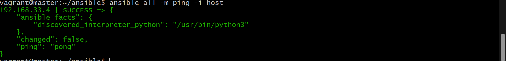

21. Then create your playbook that will be used to execute your bashscript on the slave server. Run the playbook with the command; ```ansible-playbook -i host playbook.yaml```. Always replace the 'host' with whatever title you gave to your inventory file. Below this is screen of the successful running of the playbook..

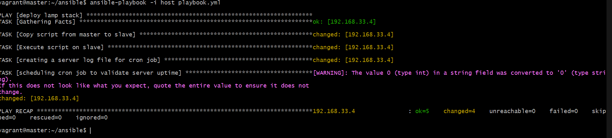

22. After this is done, you should have the Laravel landing page fully displaying on the slave server with the ip address set already to 192.168.33.14. Below is the screenshot of the evidence;

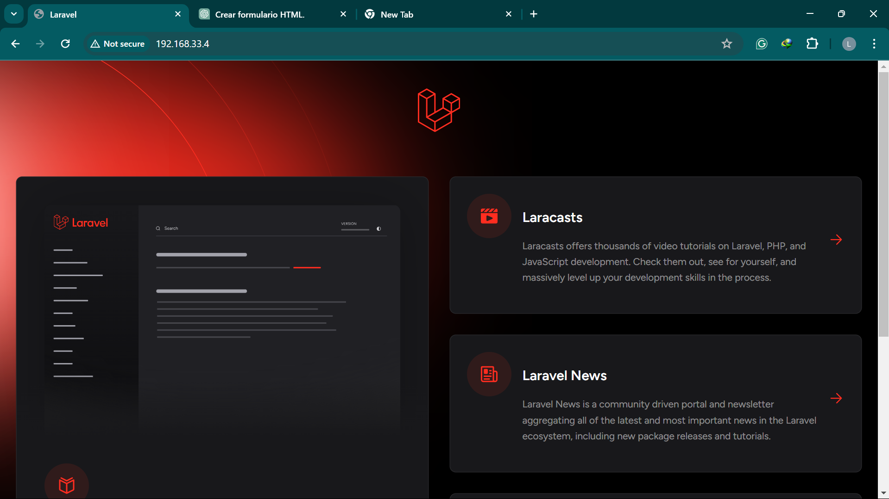

23. Script for playbook and runtime

```

---
- name: deploy lamp stack
  hosts: 192.168.33.4
  become: true

  tasks:
   - name: Copy script from master to slave
     copy:
      src: /home/vagrant/ansible/exam.sh
      dest: /home/vagrant/exam.sh
      mode: 0755

   - name: Execute script on slave
     command: /home/vagrant/exam.sh


   - name: creating a server log file for cron job
     file:
      path: /home/vagrant/server_log.log
      state: touch

   - name: scheduling cron job to validate server uptime
     cron:
      name: Validating server uptime
      minute: 0
      hour: 0
      job: uptime >> /home/vagrant/server_log.log
```


